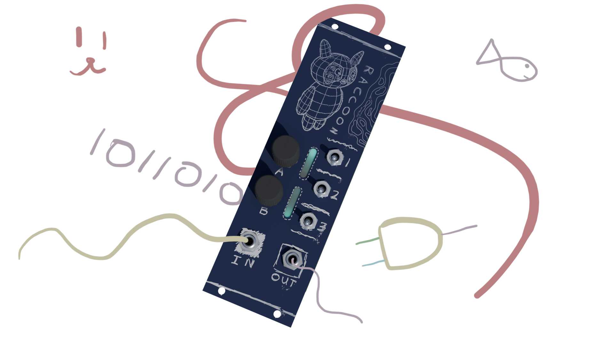
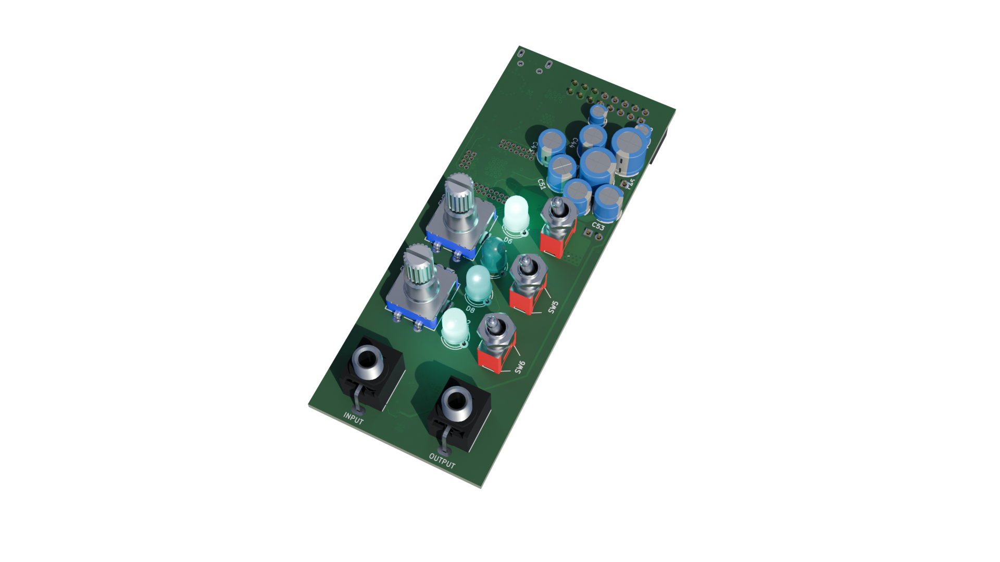
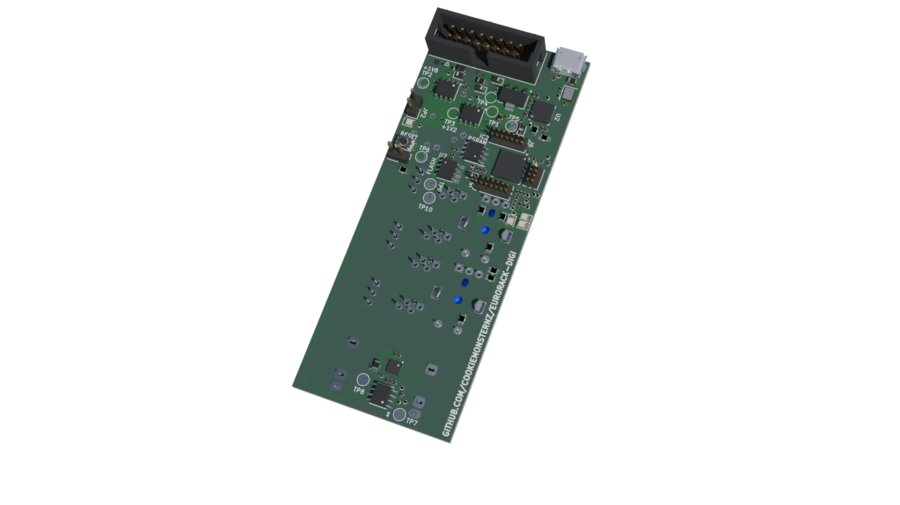
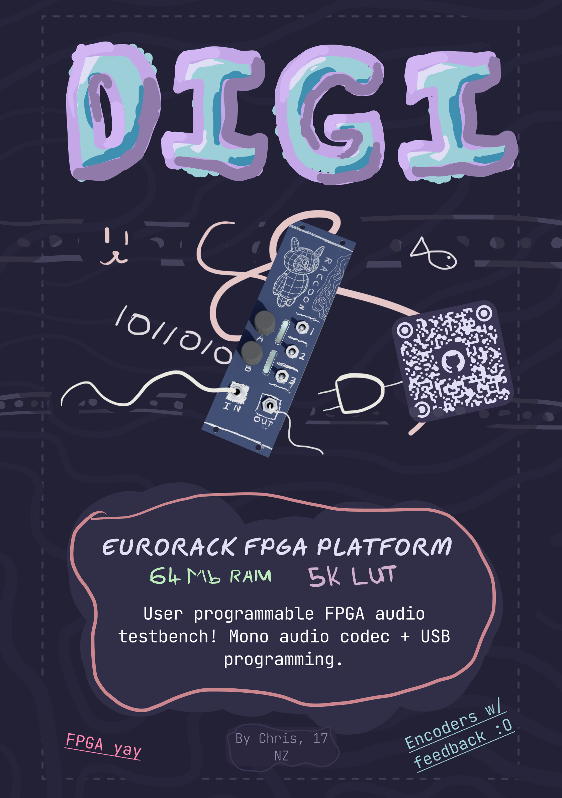

# DIGI

_FPGA based programmable eurorack effects module_

#### What?
Yet another in my line of eurorack modules. This module is a prototyping platform for fpga based effects. It has a basic mono audio codec, two rotary encoders and 3 switches. It has two small led based displays in order to provide some feedback for the encoders. It consists of two user programmable leds with a diffuser.

DIGI utilises an ice40UP5K fpga chip, featuring 5280 luts and a 48Mhz clock. This is accompanied by a USB-SPI interface for easy programming. The board includes 64Mbits of PSRAM via single channel SPI and 256kbits of flash EEPROM. 

#### Why?
First and foremost: FPGAs are cool. Unfortunately, the world is quite starved of easy to use FPGA devboards, and especially so one which is designed for audio. This module acts as an easy to use prototyping environment for audio processing which would not be possible on MCUs.

This does kind of act as a counterpart to REV, but with an FPGA as to an MCU. This provides a bit more flexibility (and performance) and also provides a lot more memory to play with. 

#### How to use?
The board has a simple audio input and output, as well as two rotary encoders and switches, which are user programmable.

In terms of getting it set up, you'll need to program the fpga. To do this, follow the general setup guides for lattice radiant. It should be configured as a project for the iCE40UP5K-SG48I. An example showing the board acting as a basic buffer is available in the gateware folder.

## Renders

## Schematics
Schematics are available as a [pdf](./hardware/digi/plots/digi.pdf) or as svgs in [hardware/digi/plots](./hardware/digi/plots/).

## Zine Page

## BOM
_Needed is how many I personally need :)_
| Part                            | Quantity | Needed | Source     | Link                                                                                                                                                           | Lot / Min Amount | Unit    | Net     | Running |
|---------------------------------|----------|--------|------------|----------------------------------------------------------------------------------------------------------------------------------------------------------------|------------------|---------|---------|---------|
| **Capacitors**                      |          |        |            |                                                                                                                                                                |                  |         |         |         |
| 20p Cap, 0402                   | 2        | 2      | JLCPCB     | https://jlcpcb.com/partdetail/1906-0402CG200J500NT/C1554                                                                                                       | 1                | $0.0021 | $0.0042 | $0.01   |
| 10n Cap, 0402                   | 4        | 4      | JLCPCB     | https://jlcpcb.com/partdetail/15869-CL05B103KB5NNNC/C15195                                                                                                     | 1                | $0.0025 | $0.0100 | $0.01   |
| 100n Cap, 0402                  | 25       | 25     | JLCPCB     | https://jlcpcb.com/partdetail/291005-CL05B104KB54PNC/C307331                                                                                                   | 1                | $0.0076 | $0.1900 | $0.20   |
| 1u Cap, 0402                    | 12       | 12     | JLCPCB     | https://jlcpcb.com/partdetail/53938-CL05A105KA5NQNC/C52923                                                                                                     | 1                | $0.0069 | $0.0828 | $0.28   |
| 4.7u Cap, 0402                  | 6        | 6      | JLCPCB     | https://jlcpcb.com/partdetail/24469-CL05A475MP5NRNC/C23733                                                                                                     | 1                | $0.0107 | $0.0642 | $0.35   |
| 10u Cap, 0402                   | 2        | 2      | JLCPCB     | https://jlcpcb.com/partdetail/16204-CL05A106MQ5NUNC/C15525                                                                                                     | 1                | $0.0186 | $0.0372 | $0.38   |
| 22u Cap, 0603                   | 1        | 1      | JLCPCB     | https://jlcpcb.com/partdetail/60514-CL10A226MQ8NRNC/C59461                                                                                                     | 1                | $0.0224 | $0.0224 | $0.41   |
| 10u Electrolytic Cap, P1.5xD4.0 | 2        | 0      | LCSC       | https://www.lcsc.com/product-detail/C503219.html                                                                                                               | 10               | $0.0143 | $0.0000 | $0.41   |
| 47u Electrolytic Cap, P2.5xD6.3 | 5        | 0      | LCSC       | https://www.lcsc.com/product-detail/C107641.html?spm=wm.fly.bg.7.xh___wm.fly.tp.1.ml&lcsc_vid=QAJaU1UHTldXXgADFFBaVFVfFFAMBl0CFVAIBQZQRVMxVlNeRlNcV1JXRFRaXjtW | 10               | $0.0665 | $0.0000 | $0.41   |
| 470u Electrolytic Cap, P5xD10.0 | 2        | 0      | LCSC       | https://www.lcsc.com/product-detail/C338196.html?spm=wm.fly.bg.3.xh___wm.fly.tp.1.ml&lcsc_vid=QAJaU1UHTldXXgADFFBaVFVfFFAMBl0CFVAIBQZQRVMxVlNeRlNcV1JXRFRaXjtW | 5                | $0.1883 | $0.0000 | $0.41   |
| **Resistors**                       |          |        |            |                                                                                                                                                                |                  |         |         |         |
| 0? Resistor, 0402               | 6        | 6      | JLCPCB     | https://jlcpcb.com/partdetail/17853-0402WGF0000TCE/C17168                                                                                                      | 1                | $0.001  | $0.0066 | $0.41   |
| 10? Resistor, 0402              | 1        | 1      | JLCPCB     | https://jlcpcb.com/partdetail/25820-0402WGF100JTCE/C25077                                                                                                      | 1                | $0.001  | $0.0009 | $0.41   |
| 100? Resistor, 0402             | 4        | 4      | JLCPCB     | https://jlcpcb.com/partdetail/25819-0402WGF1000TCE/C25076                                                                                                      | 1                | $0.0012 | $0.0048 | $0.42   |
| 470? Resistor, 0402             | 1        | 1      | JLCPCB     | https://jlcpcb.com/partdetail/25860-0402WGF4700TCE/C25117                                                                                                      | 1                | $0.0010 | $0.0010 | $0.42   |
| 1k? Resistor, 0402              | 2        | 2      | JLCPCB     | https://jlcpcb.com/partdetail/12256-0402WGF1001TCE/C11702                                                                                                      | 1                | $0.0011 | $0.0022 | $0.42   |
| 2.2k? Resistor, 0402            | 2        | 2      | JLCPCB     | https://jlcpcb.com/partdetail/26622-0402WGF2201TCE/C25879                                                                                                      | 1                | $0.0010 | $0.0020 | $0.42   |
| 10k? Resistor, 0805             | 8        | 8      | JLCPCB     | https://jlcpcb.com/partdetail/18102-0805W8F1002T5E/C17414                                                                                                      | 1                | $0.0034 | $0.0272 | $0.45   |
| 12k? Resistor, 0402             | 1        | 1      | JLCPCB     | https://jlcpcb.com/partdetail/26495-0402WGF1202TCE/C25752                                                                                                      | 1                | $0.0010 | $0.0010 | $0.45   |
| 39k? Resistor, 0402             | 1        | 1      | JLCPCB     | https://jlcpcb.com/partdetail/26526-0402WGF3902TCE/C25783                                                                                                      | 1                | $0.0011 | $0.0011 | $0.45   |
| 100k? Resistor, 0402            | 1        | 1      | JLCPCB     | https://jlcpcb.com/partdetail/26484-0402WGF1003TCE/C25741                                                                                                      | 1                | $0.0010 | $0.0010 | $0.45   |
| 1M? Resistor, 0402              | 1        | 1      | JLCPCB     | https://jlcpcb.com/partdetail/26826-0402WGF1004TCE/C26083                                                                                                      | 1                | $0.0011 | $0.0011 | $0.46   |
| **Diodes**                          |          |        |            |                                                                                                                                                                |                  |         |         |         |
| 1N4148WS, SOD-323               | 1        | 1      | JLCPCB     | https://jlcpcb.com/partdetail/2485-1N4148WS/C2128                                                                                                              | 1                | $0.0092 | $0.0092 | $0.46   |
| 1N5819WS, SOD-323               | 4        | 4      | JLCPCB     | https://jlcpcb.com/partdetail/GuangdongHottech-1N5819WS/C191023                                                                                                | 1                | $0.0111 | $0.0444 | $0.51   |
| **Other Components**                |          |        |            |                                                                                                                                                                |                  |         |         |         |
| TL072CDT                        | 1        | 1      | JLCPCB     | https://jlcpcb.com/partdetail/STMicroelectronics-TL072CDT/C6961                                                                                                | 1                | $0.1570 | $0.1570 | $0.67   |
| EC11 Rotary Encoder SW          | 2        | 0      | Aliexpress | https://www.aliexpress.com/item/1005010400760178.html                                                                                                          | 5                | $0.8580 | $0.0000 | $0.67   |
| SPDT Switch                     | 3        | 3      | Aliexpress | https://www.aliexpress.com/item/1005005370002265.html                                                                                                          | 5                | $0.8520 | $4.2600 | $4.93   |
| PJ301M-12 Audio Jack            | 2        | 0      | Aliexpress | https://www.aliexpress.com/item/1005004864182675.html                                                                                                          | 10               | $0.4440 | $0.0000 | $4.93   |
| 2x08 IDC Connector              | 1        | 0      | LCSC       | https://www.lcsc.com/product-detail/C7430313.html                                                                                                              | 5                | $0.0993 | $0.0000 | $4.93   |
| X322512MSB4SI 12MHz Crystal     | 1        | 1      | JLCPCB     | https://jlcpcb.com/partdetail/YXC_CrystalOscillators-X322512MSB4SI/C9002                                                                                       | 1                | $0.0740 | $0.0740 | $5.00   |
| USB B Micro Port                | 1        | 1      | JLCPCB     | https://jlcpcb.com/partdetail/SHOUHAN-MicroXNJ/C404969                                                                                                         | 1                | $0.0406 | $0.0406 | $5.04   |
| 256kB EEPROM, AT24C256C-SSHL-T  | 1        | 1      | JLCPCB     | https://jlcpcb.com/partdetail/MicrochipTech-AT24C256C_SSHLT/C6482                                                                                              | 1                | $0.3886 | $0.3886 | $5.43   |
| 64Mbit PSRAM, APS6404L-SQN-SN   | 1        | 1      | JLCPCB     | https://jlcpcb.com/partdetail/APMemory-APS6404L_SQNSN/C5360304                                                                                                 | 1                | $2.4684 | $2.4684 | $7.90   |
| Neopixel tht, 5mm               | 8        | 8      | Aliexpress | https://www.aliexpress.com/item/1005006447915276.html                                                                                                          | 20               | $0.2595 | $5.1900 | $13.09  |
| Audio Codec, ES8311             | 1        | 1      | JLCPCB     | https://jlcpcb.com/partdetail/1044199-ES8311/C962342                                                                                                           | 1                | $0.5514 | $0.5514 | $13.64  |
| Reset Button                    | 1        | 1      | JLCPCB     | https://jlcpcb.com/partdetail/XUNPU-TS_1088AR02016/C720477                                                                                                     | 1                | $0.0551 | $0.0551 | $13.69  |
| Ferrite Bead, 600R              | 2        | 2      | JLCPCB     | https://jlcpcb.com/partdetail/Sunlord-GZ2012D601TF/C1017                                                                                                       | 1                | $0.0323 | $0.0646 | $13.76  |
| 22uH Inductor, 0805             | 2        | 2      | JLCPCB     | https://jlcpcb.com/partdetail/Sunlord-SDFL2012T220KTF/C32375                                                                                                   | 1                | $0.0689 | $0.1378 | $13.90  |
| LED Yellow                      | 1        | 1      | JLCPCB     | https://jlcpcb.com/partdetail/Hubei_KENTOElec-KT0805Y/C2296                                                                                                    | 1                | $0.0152 | $0.0152 | $13.91  |
| LED Green                       | 1        | 1      | JLCPCB     | https://jlcpcb.com/partdetail/Hubei_KENTOElec-KT0805G/C2297                                                                                                    | 1                | $0.0162 | $0.0162 | $13.93  |
| LED Red                         | 1        | 1      | JLCPCB     | https://jlcpcb.com/partdetail/85425-NCD0805R1/C84256                                                                                                           | 1                | $0.0133 | $0.0133 | $13.94  |
| AMS1117-3.3                     | 1        | 1      | JLCPCB     | https://jlcpcb.com/partdetail/Advanced_MonolithicSystems-AMS1117_33/C6186                                                                                      | 1                | $0.1971 | $0.1971 | $14.14  |
| XL1509-ADJ                      | 2        | 2      | JLCPCB     | https://jlcpcb.com/partdetail/XLSEMI-XL1509ADJE1/C74192                                                                                                        | 1                | $0.2717 | $0.5434 | $14.68  |
| **Other**                           |          |        |            |                                                                                                                                                                |                  |         |         |         |
| PCB                             | 1        | 1      | JLCPCB     | NA                                                                                                                                                             | 5                | $1.6600 | $8.3000 | $22.98  |
| Aluminium Plate (100x200x2mm)   | 1        | 1      | Aliexpress | https://www.aliexpress.com/item/1005007160296738.html                                                                                                          | 1                | $6.2300 | $6.2300 | $29.21  |
| **Total**                           |          |        |            |                                                                                                                                                                |                  |         |         | $29.21  |

| **Totals**                          | **Money**  |
|---------------------------------|--------|
| Aliexpress, Inc. Shipping + Tax | $24.57 |
| JLCPCB, Inc. Shipping + Tax     | $38.84 |
| Total                           | $63.41 |

## CAD Links
Heres the links to the CAD source, Onshape:
[Panel source](https://cad.onshape.com/documents/423b155ae421053f9c0db9a4/w/13826012c5a1515169c92444/e/776c4f51f2d171959c208a60?renderMode=0&uiState=6a7d7e6ffb2cc2f8f4025e10)

## Directory Structure
- **hardware/**
    - **bom/** - BOM Files (CSV and LibreOffice Calc)
    - **cad/** - CAD Files
        - **render/** - Files for rendering (inc. gltf models)
    - **digi/** - KiCad files
        - **lib/** - External libraries
        - **production/** - Production files (Gerber, etc.)
        - **plots/** - Schematic plot
- **journals/**
- **zine/** - Zine page

#### This project was created for [Hack Club](https://hackclub.com/) - [Fallout](https://fallout.hackclub.com/)